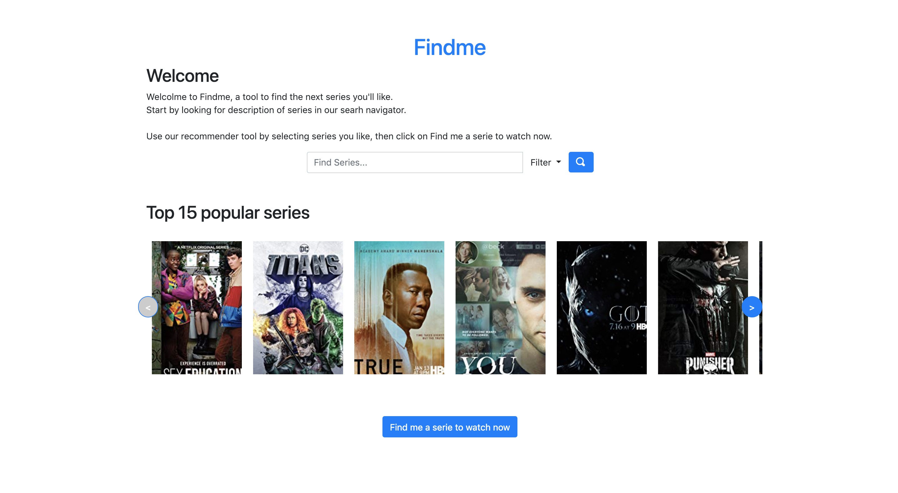
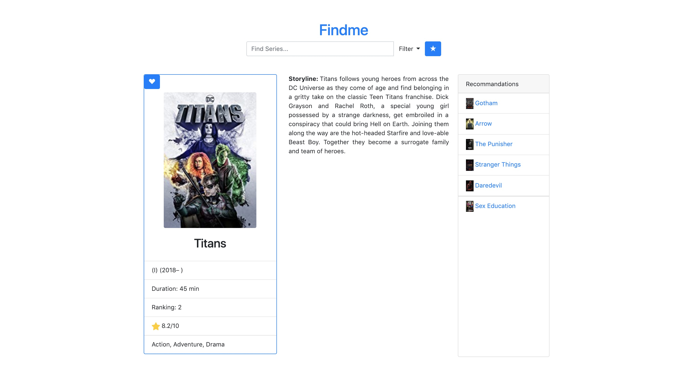

# IMDb_app

- Course : DRIO-4302C Data Engineering
- February 3, 2019
- Students : Vincent Barbosa Vaz, William Cardoso
- Teacher : Daniel Courivaud, Raphaël Courivaud

## DISCLAIMER

This project is for informational and educational purposes, do not use it for business purposes.

## Tasks

- [x] IMDb scraping with Scrapy
- [x] Flask application
- [x] MongoDB database
- [ ] Docker
	- [x] docker-compose.yml
	- [x] Dockerfile
	- [ ] run mongodb inside Docker
	- [ ] run elasticsearch inside Docker

## The project

Crawling/scraping of [IMDb](https://www.imdb.com/) for series, with Scrapy.

Save data into MongoDB database.

Create a Flask web-app to display the data.

The user likes series he loves (through Elasticsearch), the app match the bests series to watch.

### Home Page



### Title selection



# Run the project

Clone it :

```bash
git clone https://github.com/v-barbosavaz/DRIO4302C
```

## From Docker

```bash
cd DRIO4302C
docker-compose up -d
```

## Locally

```bash
cd DRIO4302C
pipenv shell
pipenv run python run.py
```