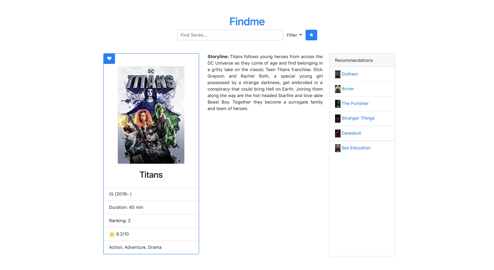

# USER GUIDE
This document is intended for users. It describes how to run and use the application.

## Start/Run project

Clone the project :

```bash
git clone https://github.com/v-barbosavaz/DRIO4302C
```

### From Docker

```bash
cd DRIO4302C
docker-compose up -d
```

### Locally

```bash
cd DRIO4302C
pipenv shell
pipenv run python run.py
```

Then, open in your navigator:

http://0.0.0.0:5000/

## Use the app

### Home Page

Click on the movie posters.


### Title selection

Read the informations, add to favs if you like.

